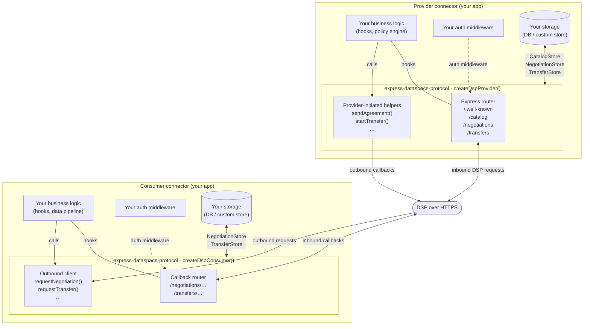
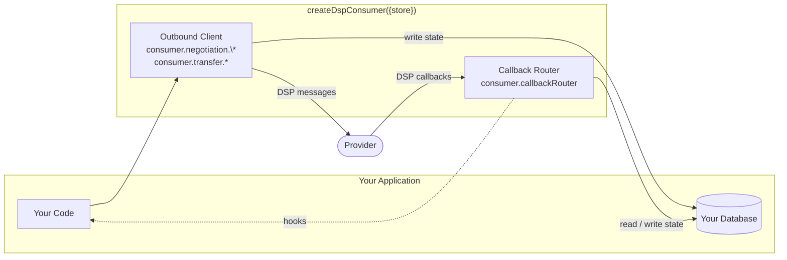

# Express Dataspace Protocol

Express.js implementation of the [Eclipse Dataspace Protocol (DSP) 2025-1](https://eclipse-dataspace-protocol-base.github.io/DataspaceProtocol/2025-1/).

This library handles the full HTTP layer for both the **Provider** and **Consumer** roles; catalog serving, contract negotiation, and transfer process. Your application only implements business decisions.

[](https://www.npmjs.com/package/express-dataspace-protocol)
[](LICENSE.md)

## Table of Contents

- [What is DSP?](#what-is-dsp)
- [Architecture overview](#architecture-overview)
- [Features](#features)
- [Requirements](#requirements)
- [Installation](#installation)
- [Quick Start](#quick-start)
  - [Provider](#provider)
  - [Consumer](#consumer)
- [Hook System](#hook-system)
- [Authentication](#authentication)
- [Persistence](#persistence)
- [Full Documentation](#full-documentation)
- [License](#license)

## What is DSP?

The **Eclipse Dataspace Protocol** is an open standard developed by initially by IDSA and now maintained by the Eclipse Foundation that defines how connectors in a data space exchange data offers, negotiate contracts, and transfer data. It specifies two state-machine driven sub-protocols:

| Protocol | Acronym | Purpose |
|---|---|---|
| Contract Negotiation Protocol | CNP | Offer → Agreement → Finalized handshake |
| Transfer Process Protocol | TPP | Data channel lifecycle management |

Plus a **Catalog Protocol** for advertising available DCAT datasets with ODRL-based access policies.

This library implements DSP 2025-1 over HTTP. All state transitions, message shapes, and endpoint paths follow the specification exactly; your code only handles the business logic around those transitions.

## Architecture overview



## Features

- **Full DSP 2025-1 coverage**: Catalog, CNP, and TPP for both Provider and Consumer roles
- **Provider HTTP server**: Express router with all required DSP endpoints, including `/.well-known/dspace-version`
- **Consumer outbound client**: Typed helpers for every Protocol request a Consumer makes to a Provider
- **Consumer callback router**: Express router that receives and processes inbound Provider messages
- **Dual-role support**: Run Provider and Consumer in the same process
- **Hook system**: React to inbound messages with your own async business logic
- **Pluggable auth**: Bring any Express `RequestHandler` (JWT, API key, OAuth2, mTLS…)
- **Pluggable persistence**: Implement store interfaces backed by any database; built-in disk store for development
- **Provider-initiated events**: Typed helpers to send agreements, counter-offers, start/complete/suspend/terminate transfers
- **TypeScript-first**: Full type declarations shipped, no separate `@types` package needed

## Requirements

- **Node.js ≥ 18** (uses native `fetch`)
- **Express 4.x** (peer dependency)

## Installation

```bash
npm install express-dataspace-protocol
```

Express is a peer dependency. Install it alongside if you have not already:

```bash
npm install express
```

## Quick Start

### Provider

The Provider owns data. It serves DSP HTTP endpoints, drives agreement and finalization, and calls back to Consumers.

```typescript
import express from 'express';
import { createDspProvider, createDiskStore } from 'express-dataspace-protocol';

const app = express();
app.use(express.json());

// Built-in disk store - swap for a real database in production (see Persistence)
const store = await createDiskStore({ dir: './data' });

const provider = createDspProvider({
  store,
  // Public URL of this provider's DSP API, included in outbound protocol messages
  providerAddress: 'https://my-provider.example.com/dsp',
  // Returns an Authorization header value for outbound calls to Consumers
  getOutboundToken: async (consumerCallbackUrl) => {
    return `Bearer ${await tokenVault.getToken(consumerCallbackUrl)}`;
  },
  // Optional: protect all inbound routes with your auth middleware
  auth: jwtAuth,
});

// /.well-known/dspace-version  - always unauthenticated, per DSP §4.3
app.use(provider.wellKnownRouter);
// All protocol routes under your chosen base path
app.use('/dsp', provider.router);

app.listen(3000);
```

This mounts all required Provider endpoints:

| Route | DSP reference |
|---|---|
| `GET /.well-known/dspace-version` | §4.3 |
| `POST /dsp/catalog/request` | §6.2.1 |
| `GET /dsp/catalog/datasets/:id` | §6.2.2 |
| `POST /dsp/negotiations/request` | §8.2.2 |
| `GET /dsp/negotiations/:providerPid` | §8.2.1 |
| `POST /dsp/negotiations/:providerPid/request` | §8.2.3 |
| `POST /dsp/negotiations/:providerPid/events` | §8.2.4 |
| `POST /dsp/negotiations/:providerPid/agreement/verification` | §8.2.5 |
| `POST /dsp/negotiations/:providerPid/termination` | §8.2.6 |
| `POST /dsp/transfers/request` | §10.2.2 |
| `GET /dsp/transfers/:providerPid` | §10.2.1 |
| `POST /dsp/transfers/:providerPid/start` | §10.2.3 |
| `POST /dsp/transfers/:providerPid/completion` | §10.2.4 |
| `POST /dsp/transfers/:providerPid/suspension` | §10.2.6 |
| `POST /dsp/transfers/:providerPid/termination` | §10.2.5 |

#### Provider-initiated events

The Provider can also push messages to Consumers outside of the request/response cycle:

```typescript
// Send an agreement to the Consumer
await provider.negotiation.sendAgreement(consumerCallbackUrl, negotiation);

// Finalize a negotiation
await provider.negotiation.finalizeNegotiation(consumerCallbackUrl, negotiation);

// Start a transfer
await provider.transfer.providerStartTransfer(consumerCallbackUrl, transfer);

// Complete, suspend, or terminate
await provider.transfer.providerCompleteTransfer(consumerCallbackUrl, transfer);
await provider.transfer.providerSuspendTransfer(consumerCallbackUrl, transfer);
await provider.transfer.providerTerminateTransfer(consumerCallbackUrl, transfer);
```

### Consumer

The Consumer wants data. It makes outbound requests to Providers and receives callback messages from them.

```typescript
import express from 'express';
import { createDspConsumer, createDiskStore } from 'express-dataspace-protocol';

const app = express();
app.use(express.json());

const store = await createDiskStore({ dir: './consumer-data' });

const consumer = createDspConsumer({
  // URL that Providers will call back on - must be publicly reachable
  callbackAddress: 'https://my-connector.example.com/dsp/callback',
  store: {
    negotiation: store.negotiation,
    transfer: store.transfer,
  },
  auth: jwtAuth,
  getOutboundToken: async (providerBase) => `Bearer ${myToken}`,
});

// Mount the callback router at the base of your callbackAddress path
app.use('/dsp/callback', consumer.callbackRouter);

app.listen(3001);
```

#### Making outbound requests

```typescript
const PROVIDER = 'https://provider.example.com/dsp';

// Browse a Provider's catalog
const catalog = await consumer.catalog.requestCatalog(PROVIDER);

// Start a negotiation
const negotiation = await consumer.negotiation.requestNegotiation(PROVIDER, {
  callbackAddress: consumer.callbackAddress,
  offer: {
    '@id': 'urn:offer:1',
    target: 'urn:dataset:42',
    permission: [{ action: 'use' }],
  },
});

// Accept a counter-offer received via callback
await consumer.negotiation.acceptNegotiation(PROVIDER, negotiation.providerPid, negotiation.consumerPid);

// Verify the agreement once received
await consumer.negotiation.verifyAgreement(PROVIDER, negotiation.providerPid, negotiation.consumerPid);

// Request a transfer after the negotiation is FINALIZED
const transfer = await consumer.transfer.requestTransfer(PROVIDER, {
  agreementId: 'urn:agreement:abc',
  format: 'HTTP_PULL',
  callbackAddress: consumer.callbackAddress,
});
```

#### Why the store is required for the Consumer

The `store` is shared between two independent components inside `createDspConsumer`:

- **Outbound client** (`consumer.negotiation.*`, `consumer.transfer.*`) -> writes a record after `requestNegotiation` / `requestTransfer`, and mirrors every subsequent state advancement locally after each successful outbound call.
- **Callback router** (`consumer.callbackRouter`) -> looks up records by `consumerPid` when the Provider sends callbacks. If the record does not exist, it returns 404 and the flow breaks.



See [docs/usage.md](docs/usage.md#the-store-shared-state-between-outbound-calls-and-inbound-callbacks) for the full annotated sequence diagram showing every store read and write across a complete negotiation.

## Hook System

Hooks let you run async business logic when the library processes an inbound message, without having to intercept HTTP directly. They are fire-and-forget, a hook error is logged but never disrupts the protocol response.

Four interfaces cover every inbound message for both sides:

| Interface | Applied to |
|---|---|
| `ConsumerNegotiationHooks` | Messages received on the Consumer callback (offers, agreements, events, terminations) |
| `ConsumerTransferHooks` | Transfer callbacks the Consumer receives (start, completion, suspension, termination) |
| `ProviderNegotiationHooks` | Negotiation requests the Provider receives from Consumers |
| `ProviderTransferHooks` | Transfer requests the Provider receives from Consumers |

### Consumer-side hooks

```typescript
const consumer = createDspConsumer({
  callbackAddress: 'https://my-connector.example.com/dsp/callback',
  store: { negotiation: store.negotiation, transfer: store.transfer },
  hooks: {
    negotiation: {
      // A Provider sent us an unsolicited offer
      onOfferReceived: async (negotiation) => {
        if (myPolicy.accepts(negotiation.offer)) {
          await consumer.negotiation.acceptNegotiation(
            PROVIDER,
            negotiation.providerPid,
            negotiation.consumerPid
          );
        }
      },
      // Provider approved - verify it to move to FINALIZED
      onAgreementReceived: async (negotiation) => {
        await consumer.negotiation.verifyAgreement(
          PROVIDER,
          negotiation.providerPid,
          negotiation.consumerPid
        );
      },
      // Negotiation is now FINALIZED - time to request a transfer
      onNegotiationFinalized: async (negotiation) => {
        await consumer.transfer.requestTransfer(PROVIDER, {
          agreementId: negotiation.agreement.id,
          format: 'HTTP_PULL',
          callbackAddress: consumer.callbackAddress,
        });
      },
    },
    transfer: {
      // Provider started the data channel - begin consuming data
      onTransferStarted: async (transfer) => {
        await dataPipeline.start(transfer.dataAddress);
      },
    },
  },
});
```

### Provider-side hooks

```typescript
const provider = createDspProvider({
  store,
  providerAddress: 'https://my-provider.example.com/dsp',
  getOutboundToken: async (url) => `Bearer ${tokenVault.getToken(url)}`,
  hooks: {
    negotiation: {
      // A Consumer started a negotiation - decide whether to agree
      onNegotiationRequested: async (negotiation) => {
        if (await policyEngine.shallApprove(negotiation)) {
          await provider.negotiation.sendAgreement(
            negotiation.consumerPid,
            negotiation
          );
          await provider.negotiation.finalizeNegotiation(
            negotiation.consumerPid,
            negotiation
          );
        }
      },
    },
    transfer: {
      // A Consumer requested a transfer - provision the data channel
      onTransferRequested: async (transfer) => {
        const dataAddress = await channelService.provision(transfer);
        await provider.transfer.providerStartTransfer(
          transfer.consumerPid,
          { ...transfer, dataAddress }
        );
      },
    },
  },
});
```

## Authentication

### Securing inbound requests

Both factories accept an `auth` option: a standard Express `RequestHandler` applied to every inbound route (except `/.well-known/dspace-version`, which is always unauthenticated as per DSP specification).

```typescript
import { RequestHandler } from 'express';

// JWT Bearer example
const jwtAuth: RequestHandler = (req, res, next) => {
  const header = req.headers.authorization;
  if (!header?.startsWith('Bearer ')) {
    res.status(401).json({ error: 'Missing Bearer token' });
    return;
  }
  try {
    (req as any).claims = verifyToken(header.slice(7));
    next();
  } catch {
    res.status(403).json({ error: 'Invalid token' });
  }
};

const provider = createDspProvider({ store, auth: jwtAuth });
const consumer = createDspConsumer({ callbackAddress, store, auth: jwtAuth });
```

Omit `auth` entirely for unauthenticated development environments.

### Authenticating outbound requests

Both factories accept `getOutboundToken`: an async function that returns a full `Authorization` header value (e.g. `'Bearer <token>'`) before every outbound call.

```typescript
const provider = createDspProvider({
  store,
  getOutboundToken: async (targetUrl) => {
    return `Bearer ${await tokenVault.getToken(targetUrl)}`;
  },
});
```

Return `undefined` to send requests without an `Authorization` header.

## Persistence

The DSP itself does not specify where and how contracts and agreements are persisted. This is usually up to the provider or consumer's implementation to decide.
The library defines three store interfaces, `CatalogStore`, `NegotiationStore`, `TransferStore` which lets you decide and implement against any database.

### Built-in disk store (development / testing)

```typescript
import { createDiskStore } from 'express-dataspace-protocol';

const store = await createDiskStore({ dir: './data' });
// store.catalog - CatalogStore
// store.negotiation - NegotiationStore
// store.transfer - TransferStore
```

> The disk store writes JSON files under `dir/`. It is single-process and not suitable for production.

### Custom store

Implement the store interfaces for your database. For example, a PostgreSQL negotiation store:

```typescript
import { NegotiationStore, ContractNegotiation } from 'express-dataspace-protocol';
import { Pool } from 'pg';

class PgNegotiationStore implements NegotiationStore {
  constructor(private pool: Pool) {}

  async save(n: ContractNegotiation) {
    await this.pool.query(
      'INSERT INTO negotiations VALUES ($1, $2) ON CONFLICT (id) DO UPDATE SET data = $2',
      [n.id, JSON.stringify(n)]
    );
  }

  async findById(id: string) {
    const { rows } = await this.pool.query('SELECT data FROM negotiations WHERE id = $1', [id]);
    return rows[0] ? (JSON.parse(rows[0].data) as ContractNegotiation) : null;
  }

  // ... other required methods
}

const provider = createDspProvider({
  store: {
    catalog: myCatalogStore,
    negotiation: new PgNegotiationStore(pool),
    transfer: myTransferStore,
  },
});
```

## Full Documentation

The [docs/usage.md](docs/usage.md) guide covers every feature in depth:

- Dual-role connector setup (Provider + Consumer in the same process)
- Catalog filtering and pagination
- All provider-initiated protocol events with examples
- Complete hook reference for all four interfaces
- Error handling and `DspClientError`
- Architecture note explaining the two styles of outbound HTTP

## License

[MIT](LICENSE.md)
