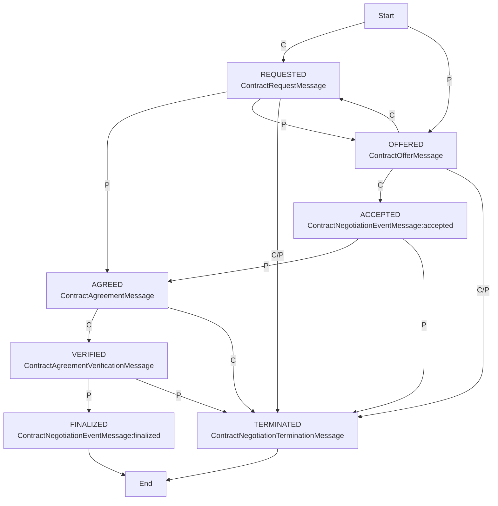
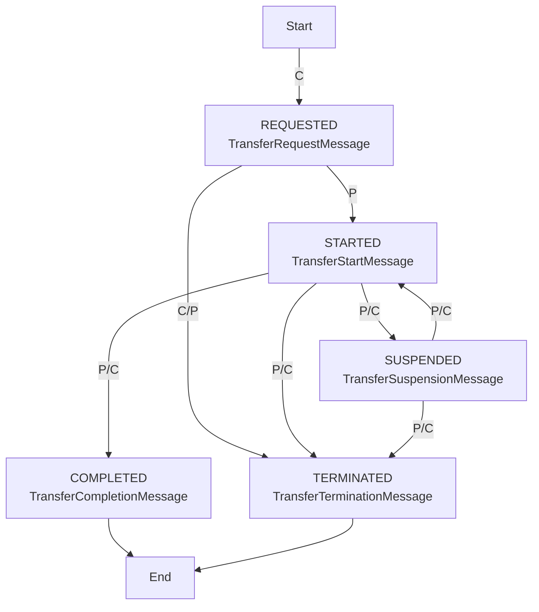

# State Machines

In mermaid representation for easier AI handling

## Contract Negotiation Protocol

P: Provider
C: Consumer

```mermaid
flowchart TD

START[Start]
Req["REQUESTED<br>ContractRequestMessage"]
Off["OFFERED<br>ContractOfferMessage"]
Acc["ACCEPTED<br>ContractNegotiationEventMessage:accepted"]
Agr["AGREED<br>ContractAgreementMessage"]
Ver["VERIFIED<br>ContractAgreementVerificationMessage"]
Fin["FINALIZED<br>ContractNegotiationEventMessage:finalized"]
Ter["TERMINATED<br>ContractNegotiationTerminationMessage"]
END[End]

START -->|C| Req
START -->|P| Off

Req -->|P| Agr
Req -->|P| Off
Req -->|C/P| Ter

Off -->|C| Req
Off -->|C| Acc
Off -->|C/P| Ter

Acc -->|P| Agr
Acc -->|P| Ter

Agr -->|C| Ver
Agr -->|C| Ter

Ver -->|P| Fin
Ver -->|P| Ter

Fin --> END
Ter --> END

```

## Transfer Process Protocol

```mermaid
flowchart TD

START[Start]
Req["REQUESTED<br>TransferRequestMessage"]
Sta["STARTED<br>TransferStartMessage"]
Sus["SUSPENDED<br>TransferSuspensionMessage"]
Com["COMPLETED<br>TransferCompletionMessage"]
Ter["TERMINATED<br>TransferTerminationMessage"]
END[End]

START -->|C| Req

Req -->|P| Sta
Req -->|C/P| Ter

Sta -->|P/C| Com
Sta -->|P/C| Sus
Sta -->|P/C| Ter

Sus -->|P/C| Sta
Sus -->|P/C| Ter

Com --> END
Ter --> END

```