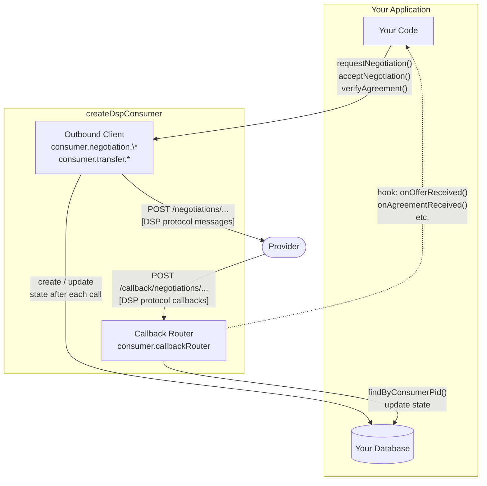
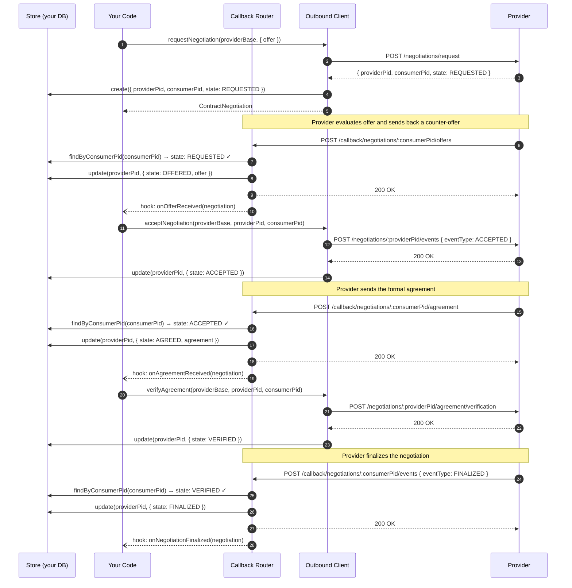

# Usage Guide

This library implements the [Eclipse Dataspace Protocol (DSP) 2025-1](https://eclipse-dataspace-protocol-base.github.io/DataspaceProtocol/2025-1/) as an Express.js package. It handles both the **Provider** role (serving catalog, negotiation, and transfer endpoints) and the **Consumer** role (making outbound requests and receiving callbacks).

> **Why Express?** The public API surfaces Express types directly (`auth: RequestHandler`, `router: Router`). A Fastify, Koa, or bare-Node user would need Express installed alongside their framework. Future framework-agnostic adapters may be added.

## Table of Contents

- [Concepts](#concepts)
- [Setting up as a Provider](#setting-up-as-a-provider)
- [Setting up as a Consumer](#setting-up-as-a-consumer)
  - [The store: shared state between outbound calls and inbound callbacks](#the-store-shared-state-between-outbound-calls-and-inbound-callbacks)
- [Dual-role connector (Provider + Consumer)](#dual-role-connector-provider--consumer)
- [Authentication](#authentication)
  - [Securing inbound requests](#securing-inbound-requests)
  - [Authenticating outbound requests (Consumer)](#authenticating-outbound-requests-consumer)
- [Persistence](#persistence)
  - [Using the built-in disk store (development / testing)](#using-the-built-in-disk-store-development--testing)
  - [Implementing a custom store](#implementing-a-custom-store)
  - [Using a database (example: PostgreSQL)](#using-a-database-example-postgresql)
- [Catalog filtering and pagination](#catalog-filtering-and-pagination)
- [Provider-initiated protocol events](#provider-initiated-protocol-events)
  - [Sending a contract agreement](#sending-a-contract-agreement)
  - [Finalizing a negotiation](#finalizing-a-negotiation)
  - [Sending a counter-offer](#sending-a-counter-offer)
  - [Starting a transfer](#starting-a-transfer)
  - [Completing, suspending, or terminating a transfer](#completing-suspending-or-terminating-a-transfer)
- [Reacting to inbound messages (hooks)](#reacting-to-inbound-messages-hooks)
  - [Consumer-side hooks](#consumer-side-hooks)
  - [Provider-side hooks](#provider-side-hooks)
- [Error handling](#error-handling)
- [Architecture note: the two styles of outbound HTTP](#architecture-note-the-two-styles-of-outbound-http)

---

## Concepts

DSP defines two roles:

| Role | Responsibility |
|---|---|
| **Provider** | Owns data. Serves DSP HTTP endpoints. Drives agreement and finalization. |
| **Consumer** | Wants data. Initiates negotiations and transfer requests. Receives provider callbacks. |

Communication is always HTTP. Every exchange is backed by a state machine (Contract Negotiation Protocol and Transfer Process Protocol). This library manages all protocol state transitions so your application only needs to handle business decisions.

---

## Setting up as a Provider

```typescript
import express from 'express';
import { createDspProvider, createDiskStore } from 'express-dataspace-protocol';

const app = express();
app.use(express.json());

// 1. Create a store (disk-backed for quick start, see Persistence section for production)
const store = await createDiskStore({ dir: './data' });

// 2. Create the provider
const provider = createDspProvider({
  store,
  // Public URL of this provider's DSP API — used in outbound protocol messages
  providerAddress: 'https://my-provider.example.com/dsp',
  // Token used when calling back to Consumers (e.g. after agreement / start transfer)
  getOutboundToken: async (consumerCallbackUrl) => {
    return `Bearer ${await tokenVault.getToken(consumerCallbackUrl)}`;
  },
});

// 3. Mount the routers
//    The well-known endpoint MUST be at root (DSP §4.3 — unauthenticated, unversioned)
app.use(provider.wellKnownRouter);
//    All DSP protocol routes go under a versioned base path
app.use('/dsp', provider.router);

app.listen(3000, () => console.log('Provider listening on :3000'));
```

This gives you:

| Method | Path | DSP reference |
|---|---|---|
| `GET` | `/.well-known/dspace-version` | §4.3 |
| `POST` | `/dsp/catalog/request` | §6.2.1 |
| `GET` | `/dsp/catalog/datasets/:id` | §6.2.2 |
| `POST` | `/dsp/negotiations/request` | §8.2.2 |
| `GET` | `/dsp/negotiations/:providerPid` | §8.2.1 |
| `POST` | `/dsp/negotiations/:providerPid/request` | §8.2.3 |
| `POST` | `/dsp/negotiations/:providerPid/events` | §8.2.4 |
| `POST` | `/dsp/negotiations/:providerPid/agreement/verification` | §8.2.5 |
| `POST` | `/dsp/negotiations/:providerPid/termination` | §8.2.6 |
| `POST` | `/dsp/transfers/request` | §10.2.2 |
| `GET` | `/dsp/transfers/:providerPid` | §10.2.1 |
| `POST` | `/dsp/transfers/:providerPid/start` | §10.2.3 |
| `POST` | `/dsp/transfers/:providerPid/completion` | §10.2.4 |
| `POST` | `/dsp/transfers/:providerPid/suspension` | §10.2.6 |
| `POST` | `/dsp/transfers/:providerPid/termination` | §10.2.5 |

---

## Setting up as a Consumer

The Consumer has two distinct sides:

- **Callback router** — an Express router that receives inbound messages from Providers (e.g. agreement notifications)
- **Outbound clients** — typed helpers for making HTTP requests to Providers

```typescript
import express from 'express';
import { createDspConsumer, createDiskStore } from 'express-dataspace-protocol';

const app = express();
app.use(express.json());

// 1. Create a store (only needs negotiation and transfer, not catalog)
const store = await createDiskStore({ dir: './consumer-data' });

// 2. Create the consumer
const consumer = createDspConsumer({
  // The URL that Providers will call back on — must be publicly reachable
  callbackAddress: 'https://my-connector.example.com/dsp/callback',

  store: {
    negotiation: store.negotiation,
    transfer: store.transfer,
  },

  // Optional: react to inbound Provider messages with your business logic
  hooks: {
    negotiation: {
      onOfferReceived: async (negotiation) => {
        // negotiation.offer has the Provider's terms — decide to accept or not
        await consumer.negotiation.acceptNegotiation(PROVIDER_BASE, negotiation.providerPid, negotiation.consumerPid);
      },
      onAgreementReceived: async (negotiation) => {
        await consumer.negotiation.verifyAgreement(PROVIDER_BASE, negotiation.providerPid, negotiation.consumerPid);
      },
      onNegotiationFinalized: async (negotiation) => {
        // negotiation.agreement is now live — persist or act on it
      },
    },
    transfer: {
      onTransferStarted: async (transfer) => {
        // For HTTP_PULL: transfer.dataAddress has the endpoint credentials
        await dataPipeline.start(transfer.dataAddress);
      },
    },
  },
});

// 3. Mount the callback router at the base of your callbackAddress path
app.use('/dsp/callback', consumer.callbackRouter);

app.listen(3001, () => console.log('Consumer listening on :3001'));
```

This gives you the inbound callback endpoints Providers will call:

| Method | Path | DSP reference |
|---|---|---|
| `GET` | `/dsp/callback/negotiations/:consumerPid` | §8.3.2 |
| `POST` | `/dsp/callback/negotiations/offers` | §8.3.3 |
| `POST` | `/dsp/callback/negotiations/:consumerPid/offers` | §8.3.4 |
| `POST` | `/dsp/callback/negotiations/:consumerPid/agreement` | §8.3.5 |
| `POST` | `/dsp/callback/negotiations/:consumerPid/events` | §8.3.6 |
| `POST` | `/dsp/callback/negotiations/:consumerPid/termination` | §8.3.7 |
| `POST` | `/dsp/callback/transfers/:consumerPid/start` | §10.3.2 |
| `POST` | `/dsp/callback/transfers/:consumerPid/completion` | §10.3.3 |
| `POST` | `/dsp/callback/transfers/:consumerPid/termination` | §10.3.4 |
| `POST` | `/dsp/callback/transfers/:consumerPid/suspension` | §10.3.5 |

### Making outbound requests

The syntax of these examples can be confusing as we are using consumer.catalog.requestCatalog(). It must be understood as "as a consumer, I want to use the catalog implementation to request a provider catalog".

```typescript
const PROVIDER_BASE = 'https://provider.example.com/dsp';

// Browse catalog
const catalog = await consumer.catalog.requestCatalog(PROVIDER_BASE);
console.log(catalog.dataset);

// Get a specific dataset
const dataset = await consumer.catalog.getDataset(PROVIDER_BASE, 'urn:dataset:42');

// Start a negotiation
const negotiation = await consumer.negotiation.requestNegotiation(PROVIDER_BASE, {
  callbackAddress: consumer.callbackAddress,
  offer: {
    '@id':  'urn:offer:1',
    target: 'urn:dataset:42',
    permission: [{ action: 'use' }],
  },
});

// Accept an offer received on the callback
await consumer.negotiation.acceptNegotiation(PROVIDER_BASE, negotiation.providerPid, negotiation.consumerPid);

// Verify after receiving the agreement callback
await consumer.negotiation.verifyAgreement(PROVIDER_BASE, negotiation.providerPid, negotiation.consumerPid);

// Request a transfer once the negotiation is FINALIZED
const transfer = await consumer.transfer.requestTransfer(PROVIDER_BASE, {
  agreementId: 'urn:agreement:abc',
  format: 'HTTP_PULL',
  callbackAddress: consumer.callbackAddress,
});
```

### The store: shared state between outbound calls and inbound callbacks

The `store` you pass to `createDspConsumer` serves **two independent components simultaneously**:

| Component | Triggered by | What it does with the store |
|---|---|---|
| **Outbound client** (`consumer.negotiation.*`, `consumer.transfer.*`) | Your code | **Creates** a record after `requestNegotiation` / `requestTransfer`; **updates** state after every subsequent call that advances the protocol |
| **Callback router** (`consumer.callbackRouter`) | Provider HTTP callbacks | **Reads** by `consumerPid` to validate the inbound message against the known state; **writes** the new post-transition state |

When you call `requestNegotiation`, the client receives the Provider's `providerPid` and `consumerPid` from the response and saves them to the store. When the Provider later calls `/callback/negotiations/:consumerPid/offers`, the callback router looks up that record by `consumerPid`. If no record exists, it returns 404, breaking the entire flow.

Every subsequent outbound call (`acceptNegotiation`, `verifyAgreement`, etc.) also mirrors its state advancement locally, so that every incoming Provider callback finds the exact pre-condition state it expects.



The following sequence diagram shows a complete CNP handshake annotated with every store read and write:



> **Rule:** if an outbound call succeeds (no `DspClientError`), the store is updated in the same call. If the HTTP request fails, the store is **not** updated — local state remains consistent with what the Provider last acknowledged.

---

## Dual-role connector (Provider + Consumer)

A single Express app can run both roles simultaneously. Each role mounts independently:

```typescript
import express from 'express';
import { createDspProvider, createDspConsumer, createDiskStore } from 'express-dataspace-protocol';

const app = express();
app.use(express.json());

const providerStore = await createDiskStore({ dir: './provider-data' });
const consumerStore = await createDiskStore({ dir: './consumer-data' });

const provider = createDspProvider({ store: providerStore });
const consumer = createDspConsumer({
  callbackAddress: 'https://my-connector.example.com/dsp/callback',
  store: {
    negotiation: consumerStore.negotiation,
    transfer: consumerStore.transfer,
  },
});

// Provider routes
app.use(provider.wellKnownRouter);            // /.well-known/dspace-version
app.use('/dsp', provider.router);             // /dsp/catalog, /dsp/negotiations, /dsp/transfers

// Consumer callback routes (under a different prefix to avoid conflicts)
app.use('/dsp/callback', consumer.callbackRouter);

app.listen(443);
```

---

## Authentication

### Securing inbound requests

Both `createDspProvider()` and `createDspConsumer()` accept an `auth` option — a standard Express `RequestHandler`. It is applied to every inbound route (except `/.well-known/dspace-version`, which is always unauthenticated per DSP §4.3).

**JWT Bearer token example:**

```typescript
import { RequestHandler } from 'express';

const jwtAuth: RequestHandler = (req, res, next) => {
  const header = req.headers.authorization;
  if (!header?.startsWith('Bearer ')) {
    res.status(401).json({ error: 'Missing Bearer token' });
    return;
  }

  try {
    // Replace verifyToken with your actual JWT library call
    const claims = verifyToken(header.slice(7));
    (req as any).claims = claims;
    next();
  } catch {
    res.status(403).json({ error: 'Invalid token' });
  }
};

const provider = createDspProvider({ store, auth: jwtAuth });
const consumer = createDspConsumer({ callbackAddress, store, auth: jwtAuth });
```

**API-key example:**

```typescript
const apiKeyAuth: RequestHandler = (req, res, next) => {
  if (req.headers['x-api-key'] !== process.env.DSP_API_KEY) {
    res.status(401).json({ error: 'Invalid API key' });
    return;
  }
  next();
};
```

If no `auth` is provided, all inbound requests are accepted (useful for local development).

### Authenticating outbound requests (Consumer)

The Consumer's outbound client calls `getOutboundToken` before every HTTP request to a Provider. Return a full `Authorization` header value (e.g. `'Bearer <token>'`) or `undefined` to send no header.

```typescript
const consumer = createDspConsumer({
  callbackAddress: 'https://my-connector.example.com/dsp/callback',
  store: { negotiation: store.negotiation, transfer: store.transfer },

  getOutboundToken: async (providerBaseUrl: string): Promise<string | undefined> => {
    // providerBaseUrl is the origin of the Provider being contacted
    // Use it to look up the right credential for that specific provider
    const token = await tokenRegistry.getToken(providerBaseUrl);
    return token ? `Bearer ${token}` : undefined;
  },
});
```

---

## Persistence

The library communicates with storage through three interfaces: `CatalogStore`, `NegotiationStore`, and `TransferStore`. You can use the provided disk adapter (not recommended for production) or implement your own.

### Using the built-in disk store (development / testing)

```typescript
import { createDiskStore } from 'express-dataspace-protocol';

const store = await createDiskStore({ dir: './dsp-data' });

// Seed your catalog (disk store only — not for production use)
await store.catalogStore.seed({
  '@context': ['https://w3id.org/dspace/2025/1/context.jsonld'],
  '@type': 'Catalog',
  '@id': 'urn:catalog:my-org',
  dataset: [
    {
      '@id': 'urn:dataset:climate-data-2024',
      '@type': 'Dataset',
      title: 'Global Climate Dataset 2024',
      hasPolicy: [
        {
          '@id': 'urn:offer:climate-open',
          permission: [{ action: 'use' }],
        },
      ],
      distribution: [],
    },
  ],
  service: [],
});

const provider = createDspProvider({ store });
```

> **Warning:** The disk store writes plain JSON files with no locking or atomicity guarantees. It is intended for local development and integration testing only. Do not use it in production.

### Implementing a custom store

Implement the three interfaces from `express-dataspace-protocol`:

```typescript
import {
  CatalogStore,
  NegotiationStore,
  TransferStore,
  DspStore,
  Catalog,
  Dataset,
  ContractNegotiation,
  TransferProcess,
} from 'express-dataspace-protocol';

class MyCatalogStore implements CatalogStore {
  async getCatalog(filter?: unknown): Promise<Catalog> {
    // Return your catalog; filter application is handled by catalogFilter option
    return db.getCatalog();
  }

  async getDataset(id: string): Promise<Dataset | null> {
    return db.findDataset(id);
  }
}

class MyNegotiationStore implements NegotiationStore {
  async create(negotiation: ContractNegotiation): Promise<ContractNegotiation> {
    return db.negotiations.insert(negotiation);
  }

  async findByProviderPid(providerPid: string): Promise<ContractNegotiation | null> {
    return db.negotiations.findOne({ providerPid });
  }

  async findByConsumerPid(consumerPid: string): Promise<ContractNegotiation | null> {
    return db.negotiations.findOne({ consumerPid });
  }

  async update(providerPid: string, patch: Partial<ContractNegotiation>): Promise<ContractNegotiation> {
    return db.negotiations.updateOne({ providerPid }, patch);
  }
}

class MyTransferStore implements TransferStore {
  // Same shape as NegotiationStore — create / findByProviderPid / findByConsumerPid / update
}

// Compose into a DspStore and hand it to the factory
const store: DspStore = {
  catalog: new MyCatalogStore(),
  negotiation: new MyNegotiationStore(),
  transfer: new MyTransferStore(),
};

const provider = createDspProvider({ store });
```

### Using a database (example: PostgreSQL)

```typescript
import { Pool } from 'pg';
import { NegotiationStore, ContractNegotiation } from 'express-dataspace-protocol';

export class PgNegotiationStore implements NegotiationStore {
  constructor(private readonly pool: Pool) {}

  async create(negotiation: ContractNegotiation): Promise<ContractNegotiation> {
    const { rows } = await this.pool.query(
      `INSERT INTO negotiations (provider_pid, consumer_pid, state, data)
       VALUES ($1, $2, $3, $4)
       RETURNING data`,
      [negotiation.providerPid, negotiation.consumerPid, negotiation.state, JSON.stringify(negotiation)]
    );
    return rows[0].data as ContractNegotiation;
  }

  async findByProviderPid(providerPid: string): Promise<ContractNegotiation | null> {
    const { rows } = await this.pool.query(
      `SELECT data FROM negotiations WHERE provider_pid = $1`,
      [providerPid]
    );
    return rows[0]?.data ?? null;
  }

  async findByConsumerPid(consumerPid: string): Promise<ContractNegotiation | null> {
    const { rows } = await this.pool.query(
      `SELECT data FROM negotiations WHERE consumer_pid = $1`,
      [consumerPid]
    );
    return rows[0]?.data ?? null;
  }

  async update(providerPid: string, patch: Partial<ContractNegotiation>): Promise<ContractNegotiation> {
    const existing = await this.findByProviderPid(providerPid);
    if (!existing) throw new Error(`Negotiation not found: ${providerPid}`);
    const updated = { ...existing, ...patch };
    await this.pool.query(
      `UPDATE negotiations SET state = $1, data = $2 WHERE provider_pid = $3`,
      [updated.state, JSON.stringify(updated), providerPid]
    );
    return updated;
  }
}
```

---

## Catalog filtering and pagination

### Filtering

By default, the `/catalog/request` endpoint returns the full catalog. If a Consumer sends a `filter` field, the endpoint returns HTTP 400 unless you provide a `catalogFilter` handler:

```typescript
const provider = createDspProvider({
  store,
  catalogFilter: async (filter, catalogStore) => {
    // filter is the raw value the Consumer sent — validate and apply it
    const query = filter as { keyword?: string };
    const full = await catalogStore.getCatalog();
    return {
      ...full,
      dataset: full.dataset?.filter((d) =>
        query.keyword ? d.title?.toLowerCase().includes(query.keyword.toLowerCase()) : true
      ),
    };
  },
});
```

### Pagination

```typescript
const provider = createDspProvider({
  store,
  catalogPaginate: (catalog, req) => {
    const page  = Number(req.query.page ?? 0);
    const limit = 20;
    const all   = catalog.dataset ?? [];
    const slice = all.slice(page * limit, (page + 1) * limit);

    return {
      data: { ...catalog, dataset: slice },
      next:  slice.length === limit ? `https://my-provider.example.com/dsp/catalog/request?page=${page + 1}` : undefined,
      prev:  page > 0              ? `https://my-provider.example.com/dsp/catalog/request?page=${page - 1}` : undefined,
    };
  },
});
```

---

## Provider-initiated protocol events

Some DSP transitions are Provider-initiated: the Provider must push a message to the Consumer's `callbackAddress`. The library handles **both** the local state update and the outbound HTTP call for all of these. You only supply your business data (the agreement, a reason string, etc.).

To enable outbound calls, configure `getOutboundToken` and `providerAddress` when you create the provider:

```typescript
const provider = createDspProvider({
  store,
  providerAddress: 'https://my-provider.example.com/dsp',
  getOutboundToken: async (consumerCallbackUrl) => {
    return `Bearer ${await tokenVault.getToken(consumerCallbackUrl)}`;
  },
});
```

### Sending a contract agreement

Called after the Consumer accepts an offer (negotiation is in `ACCEPTED` state). Transitions to `AGREED` and notifies the Consumer.

```typescript
// Called from your business logic — e.g. inside a webhook or background worker
const negotiation = await provider.negotiation.sendAgreement(providerPid, {
  '@id':      `urn:agreement:${crypto.randomUUID()}`,
  '@type':    'Agreement',
  target:     'urn:dataset:42',
  assigner:   'urn:provider:my-org',
  assignee:   'urn:consumer:their-org',
  permission: [{ action: 'use' }],
});
// negotiation.state === 'AGREED'
// Consumer has been notified automatically
```

### Finalizing a negotiation

Called after the Consumer verifies the agreement (negotiation is in `VERIFIED` state). Transitions to `FINALIZED` and notifies the Consumer.

```typescript
const negotiation = await provider.negotiation.finalizeNegotiation(providerPid);
// negotiation.state === 'FINALIZED'
// Consumer receives ContractNegotiationEventMessage { eventType: 'FINALIZED' }
```

### Sending a counter-offer

Called when the Provider wants to counter an incoming negotiation request (negotiation is in `REQUESTED` state). Transitions to `OFFERED` and notifies the Consumer.

Requires `providerAddress` to be set so the Consumer knows where to call back.

```typescript
const negotiation = await provider.negotiation.sendCounterOffer(providerPid, {
  '@id':      'urn:offer:modified',
  target:     'urn:dataset:42',
  permission: [{ action: 'use', constraint: [{ leftOperand: 'purpose', operator: 'eq', rightOperand: 'research' }] }],
});
// negotiation.state === 'OFFERED'
// Consumer receives ContractOfferMessage with the modified offer
```

### Terminating a negotiation (as Provider)

```typescript
const negotiation = await provider.negotiation.terminateNegotiationAsProvider(providerPid, {
  code:   'POLICY_VIOLATION',
  reason: ['Assignee does not meet usage policy requirements'],
});
// negotiation.state === 'TERMINATED'
// Consumer receives ContractNegotiationTerminationMessage
```

### Starting a transfer

Called after the Consumer requests a transfer (transfer is in `REQUESTED` state). Transitions to `STARTED` and notifies the Consumer. For pull transfers, include a `dataAddress` with the endpoint credentials.

```typescript
const transfer = await provider.transfer.providerStartTransfer(providerPid, {
  // dataAddress is required for HTTP_PULL — omit for HTTP_PUSH
  endpointType: 'https://w3id.org/idsa/v4.1/HTTP',
  endpoint:     'https://my-provider.example.com/data/files/42',
  endpointProperties: [
    { '@type': 'EndpointProperty', name: 'authorization', value: 'Bearer <data-token>' },
  ],
});
// transfer.state === 'STARTED'
// Consumer receives TransferStartMessage with the dataAddress
```

### Completing, suspending, or terminating a transfer

```typescript
// Provider signals the transfer is done
await provider.transfer.providerCompleteTransfer(providerPid);
// transfer.state === 'COMPLETED'

// Provider temporarily pauses the transfer
await provider.transfer.providerSuspendTransfer(providerPid, {
  code:   'MAINTENANCE',
  reason: ['Scheduled maintenance window'],
});
// transfer.state === 'SUSPENDED'

// Provider aborts the transfer
await provider.transfer.providerTerminateTransfer(providerPid, {
  code:   'DATA_UNAVAILABLE',
  reason: ['Source dataset has been retracted'],
});
// transfer.state === 'TERMINATED'
```

---

## Reacting to inbound messages (hooks)

Both the Consumer and the Provider can register optional callbacks — **hooks** — that fire after each inbound DSP message has been validated, its state transition applied, and the HTTP response sent. Hooks are your bridge between the protocol and your business logic.

**Key properties of hooks:**
- All hooks are optional — omit any you don't need.
- Hooks are **fire-and-forget**: the HTTP 200 response to the counterparty is sent first, then the hook runs asynchronously. Long-running work inside a hook will not delay the protocol.
- If a hook throws, the error is caught and logged — it does not affect the protocol or the HTTP response.
- The `negotiation` or `transfer` entity passed to the hook already reflects the **new state** after the transition.

### Consumer-side hooks

Fired when the Consumer receives a message **from the Provider**.

```typescript
const consumer = createDspConsumer({
  callbackAddress: '...',
  store: { negotiation: store.negotiation, transfer: store.transfer },
  hooks: {
    negotiation: {
      /**
       * Provider sent an offer (new or counter). State is now OFFERED.
       * negotiation.offer contains the Provider's proposed terms.
       * Typical response: accept, counter, or terminate.
       */
      onOfferReceived: async (negotiation) => {
        if (policyEngine.acceptable(negotiation.offer)) {
          await consumer.negotiation.acceptNegotiation(
            negotiation.callbackAddress!, // Provider's DSP base URL
            negotiation.providerPid,
            negotiation.consumerPid,
          );
        } else {
          await consumer.negotiation.terminateNegotiation(
            negotiation.callbackAddress!,
            negotiation.providerPid,
            negotiation.consumerPid,
            { code: 'POLICY_REJECTED' },
          );
        }
      },

      /**
       * Provider sent the agreement. State is now AGREED.
       * negotiation.agreement contains the full agreement terms.
       * Typical response: verify the agreement.
       */
      onAgreementReceived: async (negotiation) => {
        // Inspect negotiation.agreement before verifying
        await consumer.negotiation.verifyAgreement(
          negotiation.callbackAddress!,
          negotiation.providerPid,
          negotiation.consumerPid,
        );
      },

      /** Provider finalized the negotiation. State is now FINALIZED. */
      onNegotiationFinalized: async (negotiation) => {
        await db.agreements.save(negotiation.agreement);
      },

      /** Provider terminated. State is now TERMINATED. */
      onNegotiationTerminated: async (negotiation) => {
        await notifications.send(`Negotiation ${negotiation.consumerPid} was terminated by provider.`);
      },
    },

    transfer: {
      /**
       * Provider started the transfer. State is now STARTED.
       * For HTTP_PULL: transfer.dataAddress has the endpoint and credentials.
       */
      onTransferStarted: async (transfer) => {
        await dataPipeline.start(transfer.dataAddress);
      },

      /** Provider completed the transfer. State is now COMPLETED. */
      onTransferCompleted: async (transfer) => {
        await dataPipeline.finalize(transfer.consumerPid);
      },

      /** Provider suspended the transfer. State is now SUSPENDED. */
      onTransferSuspended: async (transfer) => {
        await dataPipeline.pause(transfer.consumerPid);
      },

      /** Provider terminated the transfer. State is now TERMINATED. */
      onTransferTerminated: async (transfer) => {
        await dataPipeline.abort(transfer.consumerPid);
      },
    },
  },
});
```

### Provider-side hooks

Fired when the Provider receives a message **from the Consumer**. The two most action-critical are `onNegotiationRequested` (decide whether to agree) and `onTransferRequested` (start the data transfer).

```typescript
const provider = createDspProvider({
  store,
  providerAddress: 'https://my-provider.example.com/dsp',
  getOutboundToken: async (url) => `Bearer ${await vault.get(url)}`,
  hooks: {
    negotiation: {
      /**
       * Consumer sent a new negotiation request (or counter-request).
       * State is now REQUESTED. negotiation.offer has their proposed terms.
       * Typical response: agree immediately, counter, or terminate.
       */
      onNegotiationRequested: async (negotiation) => {
        if (policyEngine.approve(negotiation.offer)) {
          await provider.negotiation.sendAgreement(negotiation.providerPid, {
            '@id':      `urn:agreement:${crypto.randomUUID()}`,
            '@type':    'Agreement',
            target:     negotiation.offer.target,
            assigner:   'urn:provider:my-org',
            assignee:   'urn:consumer:their-org',
            permission: negotiation.offer.permission ?? [],
          });
        } else {
          await provider.negotiation.terminateNegotiationAsProvider(
            negotiation.providerPid,
            { code: 'POLICY_REJECTED' },
          );
        }
      },

      /**
       * Consumer accepted the Provider's offer. State is now ACCEPTED.
       * Typical response: call sendAgreement().
       */
      onNegotiationAccepted: async (negotiation) => {
        await provider.negotiation.sendAgreement(negotiation.providerPid, buildAgreement(negotiation));
      },

      /**
       * Consumer verified the agreement. State is now VERIFIED.
       * Typical response: call finalizeNegotiation().
       */
      onAgreementVerified: async (negotiation) => {
        await provider.negotiation.finalizeNegotiation(negotiation.providerPid);
      },

      /** Consumer terminated. State is now TERMINATED. */
      onNegotiationTerminated: async (negotiation) => {
        await notifications.send(`Negotiation ${negotiation.providerPid} was terminated by consumer.`);
      },
    },

    transfer: {
      /**
       * Consumer sent a transfer request. State is now REQUESTED.
       * Typical response: prepare the data endpoint and call providerStartTransfer().
       */
      onTransferRequested: async (transfer) => {
        const dataAddress = await dataService.prepareEndpoint(transfer.agreementId);
        await provider.transfer.providerStartTransfer(transfer.providerPid, dataAddress);
      },

      /** Consumer restarted a suspended transfer. State is now STARTED. Resume streaming. */
      onTransferRestartedByConsumer: async (transfer) => {
        await dataService.resume(transfer.providerPid);
      },

      /** Consumer completed the transfer. State is now COMPLETED. */
      onTransferCompletedByConsumer: async (transfer) => {
        await dataService.cleanup(transfer.providerPid);
      },

      /** Consumer suspended the transfer. State is now SUSPENDED. */
      onTransferSuspendedByConsumer: async (transfer) => {
        await dataService.pause(transfer.providerPid);
      },

      /** Consumer terminated the transfer. State is now TERMINATED. */
      onTransferTerminatedByConsumer: async (transfer) => {
        await dataService.abort(transfer.providerPid);
      },
    },
  },
});
```

---

## Error handling

All DSP protocol errors are returned as JSON with the DSP error shape:

```json
{
  "@context": ["https://w3id.org/dspace/2025/1/context.jsonld"],
  "@type":    "ContractNegotiationError",
  "code":     "InvalidStateTransition",
  "reason":   ["Cannot apply ContractRequestMessage from state AGREED as CONSUMER"]
}
```

Unexpected server errors (unhandled exceptions) are caught by the built-in error middleware and returned as HTTP 500 with the same shape.

The Consumer's outbound client throws `DspClientError` on non-2xx responses:

```typescript
import { DspClientError } from 'express-dataspace-protocol';

try {
  await consumer.negotiation.requestNegotiation(PROVIDER_BASE, { ... });
} catch (err) {
  if (err instanceof DspClientError) {
    console.error(`Provider returned ${err.status} for ${err.url}`);
    console.error('Body:', err.body);
  }
}
```

---

## Architecture note: the two styles of outbound HTTP

A common question when reading this library: *both the Consumer and the Provider make outbound HTTP calls — but only the Consumer has a `client/` module. Why?*

The distinction is about **protocol role and context**:

**Consumer `client/` -> cold calls, no prior context**

The Consumer always *initiates* protocol sequences. When it calls `consumer.negotiation.requestNegotiation()`, it is starting a brand-new conversation: it constructs a full DSP message from scratch, targets an arbitrary Provider URL, and does not yet have any state stored locally. This warrants a dedicated typed client module; the calls are self-contained and independent of any prior stored record.

**Provider `provider.negotiation.*` and `provider.transfer.*` — warm calls, context already stored**

The Provider's outbound calls are *continuations* of a protocol sequence already in progress. When `provider.negotiation.sendAgreement(providerPid, agreement)` is called, the `providerPid` is looked up in the store, the Consumer's `callbackAddress` is read from that record, the state is mutated, and *then* the HTTP call is made. The logic is co-located with the handler because it directly shares the store and the state machine; it is a side-effect of a state transition, not a standalone request.

**Summary:**

| | Consumer client | Provider helpers |
|---|---|---|
| Who initiates | Always the Consumer | Always the Provider |
| Prior state available | No — constructing from scratch | Yes - reads from store |
| Target URL source | Caller supplies `providerBaseUrl` | Read from stored `callbackAddress` |
| Lives in | `src/consumer/client/` | `src/provider/handlers/` |
| Errors thrown | `DspClientError` (typed) | Generic `Error` |

